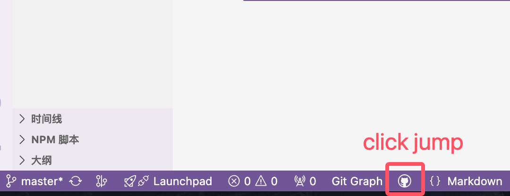

# Open Remote Repository

一个 VSCode 插件，添加一个状态栏按钮以打开远程仓库。

## 功能特性

- 在状态栏显示一个按钮，点击后打开配置的远程仓库地址
- 支持通过配置项自定义远程仓库地址模板

## 安装

在 VSCode 中搜索 "Open Remote Repository" 或直接访问 [Marketplace 链接](https://marketplace.visualstudio.com/)

## 使用方法

1. 安装插件后，状态栏会显示一个 GitHub 图标按钮。
   
2. 点击按钮，将打开配置的远程仓库地址。
3. 你可以在设置中配置远程仓库地址模板，使用 `${repoName}` 作为占位符，它将被当前项目的文件夹名称替换，详见[配置选项](#配置选项)。本插件支持任意代码托管仓跳转，仅需配置对应托管仓库地址即可。

## <a id="配置选项">配置选项</a>

- `openRemoteRepository.repoUrl`: 远程仓库地址模板。例如：`https://github.com/username/${repoName}`

```json
"openRemoteRepository": {
  "repoUrl": "https://github.com/yourUsername/${repoName}"
}
```

## 更新日志

### 1.0.0

- 初始版本发布

## 许可证

MIT
